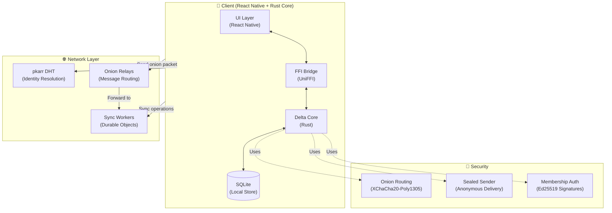

# Delta

The core repo for Delta, the encrypted P2P Discord alternative. Delta is a privacy-first messaging platform built on p2panda's operation-based CRDTs, with onion-routed message delivery and decentralized identity via the BitTorrent DHT.

## Overview

Delta provides:
- **End-to-end encrypted messaging** using p2panda's encryption schemes
- **Onion-routed message delivery** through a network of community-operated relays
- **Decentralized identity** via pkarr (public key + DHT)
- **Offline-first architecture** with local SQLite storage
- **Cross-platform** React Native app with Rust core

## Architecture



### Component Breakdown

| Component | Technology | Purpose |
|-----------|------------|---------|
| **Delta Core** | Rust (p2panda) | Cryptography, operation encoding, local database |
| **FFI Bridge** | UniFFI | Rust ↔ TypeScript/Kotlin bindings |
| **Mobile App** | React Native | UI, network management, relay discovery |
| **Onion Relays** | Cloudflare Workers | Message routing and layer peeling |
| **Sync Workers** | Durable Objects | Topic-based operation synchronization |
| **Identity** | pkarr + BitTorrent DHT | Decentralized public key distribution |

## Project Structure

```
delta/
├── app/                    # React Native mobile application
│   ├── android/           # Android-specific code & JNI libs
│   ├── ios/               # iOS-specific code
│   └── src/               # TypeScript source
│       ├── ffi/           # FFI wrapper functions
│       ├── stores/        # Zustand state management
│       ├── screens/       # React Native screens
│       └── utils/         # Utility functions
├── core/                  # Rust core library
│   ├── src/               # Rust source
│   │   ├── lib.rs         # Main library & FFI exports
│   │   ├── onion.rs       # Onion routing implementation
│   │   ├── sync_config.rs # Relay configuration storage
│   │   ├── auth.rs        # Membership authorization
│   │   ├── encryption.rs  # E2E encryption
│   │   └── db.rs          # SQLite operations
│   └── build-android.sh   # Android build script
├── relay/                 # Onion relay Workers
│   └── src/
│       ├── onion.ts       # Layer peeling logic
│       └── index.ts       # Worker entry point
├── sync/                  # Sync DO Workers
│   └── src/
│       └── topic-do.ts    # Per-topic synchronization
└── web/                   # Web profile resolution
```

## Regenerating FFI Bindings

When you modify the UDL file (`core/src/delta_core.udl`) or add new Rust exports, you must regenerate the platform bindings:

### Android (Kotlin)

```bash
cd core

# Generate Kotlin bindings from UDL (outputs to tmp first due to nested paths)
cargo run --bin uniffi-bindgen -- generate \
  --language kotlin src/delta_core.udl \
  --out-dir /tmp/uniffi \
  --no-format

# Move to correct location (uniffi creates nested uniffi/delta_core/ structure)
mv /tmp/uniffi/uniffi/delta_core/delta_core.kt \
  ../app/android/app/src/main/java/uniffi/delta_core/
```

This updates:
- `app/android/app/src/main/java/uniffi/delta_core/delta_core.kt`

### iOS (Swift)

```bash
cd core

# Generate Swift bindings from UDL
cargo run --bin uniffi-bindgen -- generate \
  --language swift src/delta_core.udl \
  --out-dir ../app/ios/DeltaApp/
```

This creates:
- `app/ios/DeltaApp/delta_core.swift`

## Setup

### Prerequisites

- [Rust](https://rustup.rs/) (latest stable)
- [Node.js](https://nodejs.org/) (v18+)
- [pnpm](https://pnpm.io/) (v8+)
- [Android Studio](https://developer.android.com/studio) (for Android)
- [Xcode](https://developer.apple.com/xcode/) (for iOS)

### Core Library Setup

```bash
# Clone the repository
git clone https://github.com/yourorg/delta.git
cd delta

# Install Rust dependencies and build
cd core
cargo build --release

# Run tests
cargo test
```

### Mobile App Setup

```bash
# Navigate to app directory
cd app

# Install dependencies
pnpm install

# iOS setup (macOS only)
cd ios && pod install && cd ..

# Android setup - copy prebuilt JNI libraries
# The core/build-android.sh script handles this
```

### Building for Android

```bash
cd core

# Build Rust core for Android targets
./build-android.sh

# This generates:
# - app/android/app/src/main/jniLibs/arm64-v8a/libdelta_core.so
# - app/android/app/src/main/jniLibs/x86_64/libdelta_core.so
# - Kotlin bindings via UniFFI
```

### Building for iOS

```bash
cd core

# Build for iOS Simulator
cargo build --target aarch64-apple-ios-sim --release

# Build for physical iOS device
cargo build --target aarch64-apple-ios --release

# Generate Swift bindings (requires uniffi-bindgen)
cargo run --bin uniffi-bindgen -- generate \
  --language swift src/delta_core.udl \
  --out-dir ../app/ios/DeltaApp/
```

### Running the App

```bash
cd app

# Start Metro bundler
pnpm start

# Run on Android
pnpm android

# Run on iOS (macOS only)
pnpm ios
```

## Use Cases

### 1. Private Communities

Create invite-only organizations with granular access control:

```typescript
// Create an organization
const orgId = await createOrg(
  "Privacy Research",
  "research-lab", 
  "Secure collaboration for privacy researchers",
  false // isPublic
);

// Generate invite token (NFC/QR compatible)
const token = generateInviteToken(orgId, "write", expiryTimestamp);

// New member redeems token
await verifyInviteToken(token, Date.now());
```

### 2. Onion-Routed Messaging

Send messages through a 3-hop onion route for metadata privacy:

```typescript
// Resolve relay hops from DHT
const { hops, refresh } = useRelayStore();
await refresh();

// Build and send onion packet
const packet = await buildOnionPacket(
  hops,
  topicId,
  opBytes
);

// First hop receives encrypted packet
await fetch(hops[0].nextUrl, {
  method: 'POST',
  body: packet
});
```

### 3. Decentralized Identity

Publish and resolve public profiles via the BitTorrent DHT:

```typescript
// Publish public profile
await createOrUpdateProfile(
  "alice",
  "Cryptography researcher",
  ["research", "privacy"],
  true // isPublic - publishes to DHT
);

// Resolve someone else's profile
const profile = await resolvePkarr("z32-encoded-key");
```

### 4. Encrypted File Sharing

Upload and share blobs with room-level encryption:

```typescript
// Upload a file
const blobId = await uploadBlob(
  fileData,
  "image/png",
  roomId
);

// Reference in message
await sendMessage(
  roomId,
  null,
  "image",
  null,
  blobId,
  null,
  [],
  null
);
```

### 5. Offline-First Sync

Operations are stored locally and sync when online:

```typescript
// Queue operation locally
const { id, opBytes } = await sendMessage(
  roomId,
  null,
  "text",
  "Hello world",
  null, null, [], null
);

// Core handles sync automatically when connected
// Sequence tracking ensures ordering
const currentSeq = await getTopicSeqFfi(topicHex);
```

## Security Model

| Layer | Mechanism | Protection |
|-------|-----------|------------|
| **Transport** | Onion Routing | Hides sender/receiver metadata from relays |
| **Payload** | XChaCha20-Poly1305 | AEAD encryption per hop |
| **Identity** | Ed25519 | Signing keys for authorship verification |
| **Messaging** | Sealed Sender | Anonymous message delivery |
| **Groups** | Group Encryption | Shared keys for room content |
| **Storage** | SQLite + Encryption | Local data protection |

## Contributing

1. Fork the repository
2. Create a feature branch (`git checkout -b feature/amazing-feature`)
3. Commit your changes (`git commit -m 'Add amazing feature'`)
4. Push to the branch (`git push origin feature/amazing-feature`)
5. Open a Pull Request

## License

[MIT](LICENSE) © Delta Contributors

## Acknowledgments

- [p2panda](https://p2panda.org/) - For the CRDT and encryption foundations
- [pkarr](https://pkarr.org/) - For decentralized identity
- [UniFFI](https://mozilla.github.io/uniffi-rs/) - For seamless Rust ↔ mobile bindings
