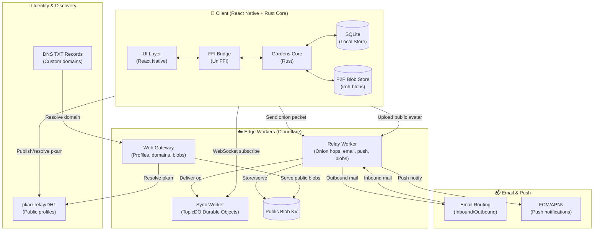

# Gardens

The core repo for Gardens, the encrypted P2P Discord alternative. Gardens is a privacy-first messaging platform built on p2panda's operation-based CRDTs, with onion-routed message delivery and decentralized identity via the BitTorrent DHT.

## Overview

Gardens provides:
- **End-to-end encrypted messaging** using p2panda's encryption schemes
- **Onion-routed message delivery** through relay workers
- **Decentralized identity** via pkarr (public key + DHT) with web gateway + custom domains
- **Offline-first architecture** with local SQLite storage
- **Content-addressed blobs** (iroh-blobs) for media and avatars
- **Durable Object sync** for topic fan-out and catch-up
- **Email + push** via relay workers (inbound/outbound email, FCM/APNs)
- **Cross-platform** React Native app with Rust core

## Architecture



### Component Breakdown

| Component | Technology | Purpose |
|-----------|------------|---------|
| **Gardens Core** | Rust (p2panda) | Cryptography, operation encoding, local database |
| **FFI Bridge** | UniFFI | Rust ↔ TypeScript/Kotlin bindings |
| **Mobile App** | React Native | UI, network management, relay discovery |
| **Blob Store** | iroh-blobs | Content-addressed media storage + P2P transfer |
| **Relay Worker** | Cloudflare Workers | Onion routing, push, email send/receive, public blob storage |
| **Sync Worker** | Cloudflare Durable Objects | Per-topic op buffering, fan-out, and catch-up |
| **Web Gateway** | Cloudflare Workers + Hono | Public profiles, custom domains, blob passthrough |
| **Identity** | pkarr relay + DHT | Public key distribution and profile TXT records |
| **Email** | Cloudflare Email Routing | Inbound routing + relay-signed outbound send |
| **Push** | FCM/APNs | Push notifications via relay |

## Operation Payloads (What an `op` Looks Like)

Gardens operations are authored on-device in Rust core, encoded as CBOR, and
transported via the sync worker.

### 1) Client → Sync Worker (`POST /deliver`)

From the React Native layer (`broadcastOp`), each op is posted as:

```json
{
  "topic_hex": "9c49275a2975118f...",
  "op_base64": "o2Zsb2dfaWRnbWVzc2FnZWtoZWFkZXJfYnl0ZXNY..."
}
```

- `topic_hex`: 64-char topic ID (room/thread/inbox topic)
- `op_base64`: base64-encoded CBOR bytes of a `GossipEnvelope`

### 2) Sync Worker → Client WebSocket (`/topic/:topic_hex`)

The sync worker pushes frames like:

```json
{
  "type": "op",
  "seq": 42,
  "data": "o2Zsb2dfaWRnbWVzc2FnZWtoZWFkZXJfYnl0ZXNY..."
}
```

- `seq`: per-topic sequence number
- `data`: same base64 CBOR `GossipEnvelope` payload

### 3) Decoded `GossipEnvelope` (CBOR → struct)

After base64 decode and CBOR decode in core:

```json
{
  "log_id": "message",
  "header_bytes": "<p2panda header bytes>",
  "body_bytes": "<op body bytes>"
}
```

`header_bytes` and `body_bytes` are binary bytes; they are not JSON on wire.

### 4) Example decoded body for a message op (`log_id = "message"`)

The body bytes decode to an op-specific payload, e.g. `MessageOp`:

```json
{
  "op_type": "send",
  "room_id": "b54c82d364e8f8ce1d06e56fe156edc6...",
  "dm_thread_id": null,
  "content_type": "text",
  "text_content": "hey",
  "blob_id": null,
  "embed_url": null,
  "mentions": [],
  "reply_to": null
}
```

Other payload structs exist for orgs, rooms, reactions, membership, threads, etc.
See `core/src/ops.rs`.

### Note on source of ops

- Normal chat/org/thread ops are created locally on device, then relayed/synced.
- A small class of ops (e.g. `receive_email`) can be server-injected by relay/email flow.

## Project Structure

```
gardens/
├── app/                    # React Native mobile application
│   ├── android/           # Android-specific code & JNI libs
│   ├── ios/               # iOS-specific code
│   └── src/               # TypeScript source
│       ├── ffi/           # FFI wrapper functions
│       ├── stores/        # Zustand state management
│       ├── screens/       # React Native screens
│       └── utils/         # Utility functions
├── core/                  # Rust core library
│   ├── src/               # Rust source
│   │   ├── lib.rs         # Main library & FFI exports
│   │   ├── onion.rs       # Onion routing implementation
│   │   ├── sync_config.rs # Relay configuration storage
│   │   ├── auth.rs        # Membership authorization
│   │   ├── encryption.rs  # E2E encryption
│   │   └── db.rs          # SQLite operations
│   └── build-android.sh   # Android build script
├── docs/                  # Design docs and implementation summaries
├── public/                # Static assets (logo)
├── relay/                 # Onion relay Workers
│   └── src/
│       ├── onion.ts       # Layer peeling logic
│       └── index.ts       # Worker entry point
├── sync/                  # Sync DO Workers
│   └── src/
│       └── topic-do.ts    # Per-topic synchronization
└── web/                   # Web profile resolution
    └── src/               # Gateway worker + pkarr resolver
```

## Recent Updates

- **Durable Object sync layer** for per-topic buffering and WebSocket fan-out.
- **Relay Worker upgrades**: onion hop delivery to sync, push notifications, inbound/outbound email, and public blob storage.
- **Web gateway** for pkarr profiles, custom domains, and public blob passthrough.
- **pkarr TXT fields** extended for relay discovery (`rl=...`) and email opt-in (`email=1`).
- **Public avatars** stored as content-addressed blobs and served via edge KV.

## Regenerating FFI Bindings

When you modify the UDL file (`core/src/gardens_core.udl`) or add new Rust exports, you must regenerate the platform bindings:

### Android (Kotlin)

```bash
cd core

# Generate Kotlin bindings from UDL (outputs to tmp first due to nested paths)
cargo run --bin uniffi-bindgen -- generate \
  --language kotlin src/gardens_core.udl \
  --out-dir /tmp/uniffi \
  --no-format

# Move to correct location (uniffi creates nested uniffi/gardens_core/ structure)
mv /tmp/uniffi/uniffi/gardens_core/gardens_core.kt \
  ../app/android/app/src/main/java/uniffi/gardens_core/
```

This updates:
- `app/android/app/src/main/java/uniffi/gardens_core/gardens_core.kt`

### iOS (Swift)

```bash
cd core

# Generate Swift bindings from UDL
cargo run --bin uniffi-bindgen -- generate \
  --language swift src/gardens_core.udl \
  --out-dir ../app/ios/GardensApp/
```

This creates:
- `app/ios/GardensApp/gardens_core.swift`

## Setup

### Prerequisites

- [Rust](https://rustup.rs/) (latest stable)
- [Node.js](https://nodejs.org/) (v18+)
- [pnpm](https://pnpm.io/) (v8+)
- [Android Studio](https://developer.android.com/studio) (for Android)
- [Xcode](https://developer.apple.com/xcode/) (for iOS)

### Core Library Setup

```bash
# Clone the repository
git clone https://github.com/yourorg/gardens.git
cd gardens

# Install Rust dependencies and build
cd core
cargo build --release

# Run tests
cargo test
```

### Mobile App Setup

```bash
# Navigate to app directory
cd app

# Install dependencies
pnpm install

# iOS setup (macOS only)
cd ios && pod install && cd ..

# Android setup - copy prebuilt JNI libraries
# The core/build-android.sh script handles this
```

### Building for Android

```bash
cd core

# Build Rust core for Android targets
./build-android.sh

# This generates:
# - app/android/app/src/main/jniLibs/arm64-v8a/libgardens_core.so
# - app/android/app/src/main/jniLibs/x86_64/libgardens_core.so
# - Kotlin bindings via UniFFI
```

### Building for iOS

```bash
cd core

# Build for iOS Simulator
cargo build --target aarch64-apple-ios-sim --release

# Build for physical iOS device
cargo build --target aarch64-apple-ios --release

# Generate Swift bindings (requires uniffi-bindgen)
cargo run --bin uniffi-bindgen -- generate \
  --language swift src/gardens_core.udl \
  --out-dir ../app/ios/GardensApp/
```

### Running the App

```bash
cd app

# Start Metro bundler
pnpm start

# Run on Android
pnpm android

# Run on iOS (macOS only)
pnpm ios
```

## Use Cases

### 1. Private Communities

Create invite-only organizations with granular access control:

```typescript
// Create an organization
const orgId = await createOrg(
  "Privacy Research",
  "research-lab", 
  "Secure collaboration for privacy researchers",
  false // isPublic
);

// Generate invite token (NFC/QR compatible)
const token = generateInviteToken(orgId, "write", expiryTimestamp);

// New member redeems token
await verifyInviteToken(token, Date.now());
```

### 2. Onion-Routed Messaging

Send messages through a 3-hop onion route for metadata privacy:

```typescript
// Resolve relay hops from DHT
const { hops, refresh } = useRelayStore();
await refresh();

// Build and send onion packet
const packet = await buildOnionPacket(
  hops,
  topicId,
  opBytes
);

// First hop receives encrypted packet
await fetch(hops[0].nextUrl, {
  method: 'POST',
  body: packet
});
```

### 3. Decentralized Identity

Publish and resolve public profiles via the BitTorrent DHT:

```typescript
// Publish public profile
await createOrUpdateProfile(
  "alice",
  "Cryptography researcher",
  ["research", "privacy"],
  true // isPublic - publishes to DHT
);

// Resolve someone else's profile
const profile = await resolvePkarr("z32-encoded-key");
```

### 4. Encrypted File Sharing

Upload and share blobs with room-level encryption:

```typescript
// Upload a file
const blobId = await uploadBlob(
  fileData,
  "image/png",
  roomId
);

// Reference in message
await sendMessage(
  roomId,
  null,
  "image",
  null,
  blobId,
  null,
  [],
  null
);
```

### 5. Offline-First Sync

Operations are stored locally and sync when online:

```typescript
// Queue operation locally
const { id, opBytes } = await sendMessage(
  roomId,
  null,
  "text",
  "Hello world",
  null, null, [], null
);

// Core handles sync automatically when connected
// Sequence tracking ensures ordering
const currentSeq = await getTopicSeqFfi(topicHex);
```

## Security Model

Gardens uses p2panda's encryption stack for end-to-end message privacy and key management. At a high level:
- **Group/DM encryption** via `p2panda_encryption` with per-room shared keys and pre-key bundles.
- **Sealed sender** envelopes so relays see only encrypted payloads, not authors.
- **Membership auth** enforced in the core via signed membership ops, invite tokens, and access-level checks (Pull/Read/Write/Manage).

| Layer | Mechanism | Protection |
|-------|-----------|------------|
| **Transport** | Onion Routing | Hides sender/receiver metadata from relays |
| **Payload** | XChaCha20-Poly1305 | AEAD encryption per hop |
| **Identity** | Ed25519 | Signing keys for authorship verification |
| **Messaging** | Sealed Sender | Anonymous message delivery |
| **Groups** | Group Encryption | Shared keys for room content |
| **Storage** | SQLite + Encryption | Local data protection |

## Contributing

1. Fork the repository
2. Create a feature branch (`git checkout -b feature/amazing-feature`)
3. Commit your changes (`git commit -m 'Add amazing feature'`)
4. Push to the branch (`git push origin feature/amazing-feature`)
5. Open a Pull Request

## License

[MIT](LICENSE) © Gardens Contributors

## Acknowledgments

- [p2panda](https://p2panda.org/) - For the CRDT and encryption foundations
- [pkarr](https://pkarr.org/) - For decentralized identity
- [UniFFI](https://mozilla.github.io/uniffi-rs/) - For seamless Rust ↔ mobile bindings
